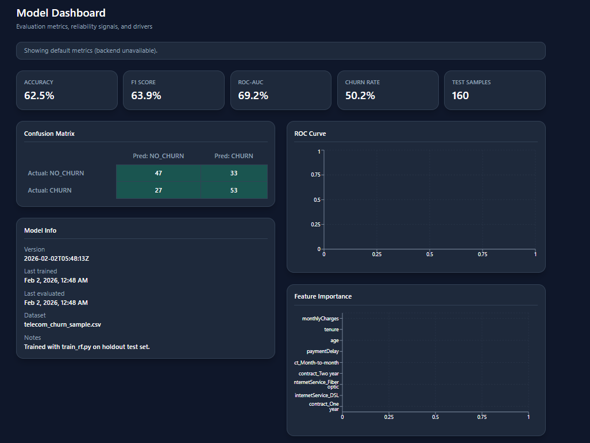
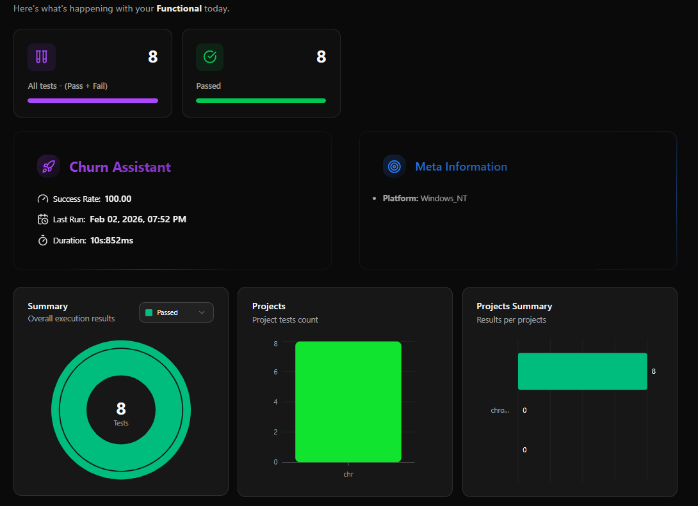
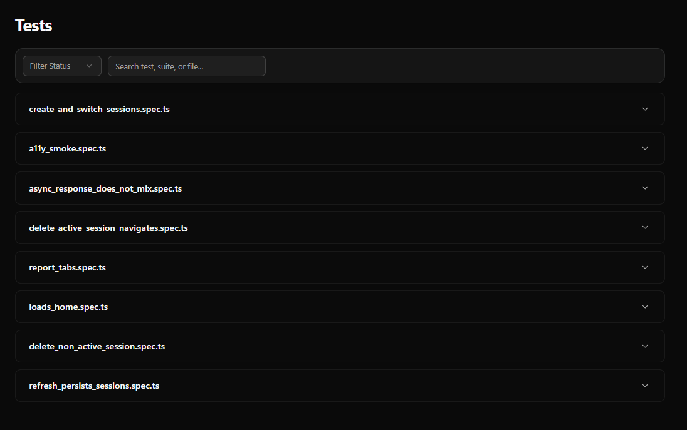
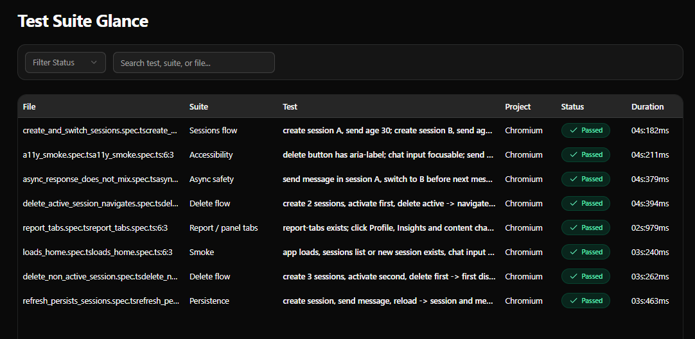

# Customer Churn Web App

*Predict customer loyalty, drive business growth.*

[](https://github.com/AhmedKamal-41/Customer-Churn-Prediction-Random-Forest-/actions/workflows/ci.yml)
[](https://github.com/AhmedKamal-41/Customer-Churn-Prediction-Random-Forest-/actions/workflows/ui-tests.yml)
[](https://github.com/AhmedKamal-41/Customer-Churn-Prediction-Random-Forest-)

## Tech stack


**Data sources:** Telecom churn CSV (see [Model training](#model-training)).

---

## Screenshots

### Chat — Churn Assistant

Step-by-step chat flow to collect customer details and get churn prediction with retention actions.


### Model Dashboard

Evaluation metrics, reliability signals, and drivers: KPIs (Accuracy, F1, ROC-AUC, Churn Rate), confusion matrix, ROC curve, feature importance, and model info.



### Automation — Ortoni report overview

Playwright/Ortoni report dashboard: all tests passed, success rate, last run, duration, and project summary.



### Automation — Tests list

UI test files and suites (sessions, accessibility, async safety, delete flow, report tabs, smoke, persistence).



### Automation — Test Suite Glance

Per-test results table: file, suite, test name, project (Chromium), status (Passed), and duration.



> **To show screenshots:** Save your four images into `docs/screenshots/` as `dashboard.png`, `automation.png`, `automation-tests.png`, and `automation-glance.png`. Add `chat.png` for the Chat section if you have it.

---

## Overview

Full-stack app for **customer churn prediction**: React (Vite) frontend, Spring Boot REST API, and a scikit-learn Random Forest model invoked via Python for predictions. The UI is a chatbot-style **Churn Assistant** that guides users through customer attributes and returns CHURN / NO_CHURN with explanations and retention recommendations.

**Features:** Chat-based prediction flow with session persistence, model dashboard (accuracy, F1, ROC-AUC, confusion matrix, feature importance), batch prediction and sessions history, light/dark theme, responsive layout, UI automation (Playwright) and Automation dashboard, CI (backend, frontend, e2e, UI tests).

---

## Project structure

```
/
  backend/     Spring Boot API (port 8080), Python ML (train + predict)
  frontend/    React + Vite (port 5173), Playwright UI tests
  e2e/         Playwright end-to-end tests (full stack)
```

---

## Prerequisites

- **Java 17** and **Maven**
- **Node.js 18+** and npm
- **Python 3.10+** (for model training and for predict; backend invokes Python at runtime)

---

## Run locally

### Backend

Ensure `backend/models/metrics.json` and `backend/models/rf_pipeline.joblib` exist (see [Model training](#model-training)). Then:

```bash
cd backend
mvn spring-boot:run
```

API runs at http://localhost:8080. From repo root: `mvn spring-boot:run -f backend/pom.xml`.

### Frontend

```bash
cd frontend
npm install
npm run dev
```

App runs at http://localhost:5173. Backend status in the header shows Online when the API is reachable; Vite proxies `/api/*` to the backend.

### Verify connection

1. `curl -i http://localhost:8080/api/health` → `{"ok":true}`
2. Open http://localhost:5173; header should show "Backend: Live". Use the chat to submit a prediction.

---

## Testing

This section describes the test strategy, UI automation coverage, how to run tests, where to find reports, and how CI runs them. Written for QA engineers and developers who run or maintain tests.

### Test strategy

| Layer | Tooling | Scope |
|-------|---------|--------|
| **Backend** | JUnit 5 (unit + integration), Maven | Controllers, services, validation; run from `backend/`. |
| **Frontend** | Build only | `npm run build`; no frontend unit test suite in repo. |
| **UI automation** | Playwright + Ortoni Report | Functional UI tests against the app with **mocked API** (MSW when `VITE_E2E=true`). No live backend required. Specs in [frontend/tests/ui/specs/](frontend/tests/ui/specs/). |
| **E2E (full stack)** | Playwright in [e2e/](e2e/) | Requires backend and frontend running; hits real API. |

### UI test suite (QA)

The functional UI suite runs in Chromium. The app is started with `VITE_E2E=true` so MSW mocks serve deterministic responses; no backend is needed. Config: [frontend/playwright.config.ts](frontend/playwright.config.ts).

| Suite / area | Spec file | What's covered |
|--------------|-----------|----------------|
| Smoke | `loads_home.spec.ts` | App load, sessions list or new session, chat input visible. |
| Accessibility | `a11y_smoke.spec.ts` | Delete button aria-label, chat input focusable, send via Enter. |
| Sessions flow | `create_and_switch_sessions.spec.ts` | Create sessions A/B, switch, verify messages per session. |
| Delete flow | `delete_active_session_navigates.spec.ts`, `delete_non_active_session.spec.ts` | Delete active (navigate to remaining); delete non-active (list updates). |
| Async safety | `async_response_does_not_mix.spec.ts` | Response appears only in session A when user switches to B before response. |
| Persistence | `refresh_persists_sessions.spec.ts` | Session and messages persist after reload. |
| Report / tabs | `report_tabs.spec.ts` | Profile/Insights tabs and content change. |

- **Reporter:** Ortoni Report (HTML in `frontend/playwright-report/`) and JSON (`playwright-report/results.json`).

### How to run tests

**Backend (unit + integration):**

```bash
cd backend
mvn test
```

**Frontend build:**

```bash
cd frontend
npm run build
```

**UI tests (local, mocked API):**  
Playwright starts the dev server with `VITE_E2E=true` automatically (see `webServer` in [frontend/playwright.config.ts](frontend/playwright.config.ts)).

```bash
cd frontend
npm install
npx playwright install
npm run test:ui
```

**View UI report locally:**

```bash
cd frontend
npm run test:ui:report
```

**E2E (full stack):** Start backend and frontend in separate terminals, then:

```bash
cd e2e
npm install
npx playwright install
npm run e2e
```

### Reports and artifacts

| Where | What |
|-------|------|
| **Local** | After `npm run test:ui`, HTML report is in `frontend/playwright-report/`. Traces, screenshots, and videos (on failure) are in `frontend/test-results/`. |
| **CI (UI tests)** | [.github/workflows/ui-tests.yml](.github/workflows/ui-tests.yml) uploads artifact **playwright-report** (always) and **playwright-test-results** (on failure); retention 7 days. Download from the Actions run. |
| **Automation dashboard** | In-app **Automation** page (route `/automation`) shows last run summary and links to the report and CI. Data comes from `frontend/public/qa/automation-summary.json` (or the deployed report URL when set). |

### CI workflows

- **[CI](.github/workflows/ci.yml):** Backend tests, frontend build, and e2e (full stack) on push/PR to main/master. Uses caches for Maven, npm (e2e), pip, Playwright browsers, and frontend `node_modules`.
- **[UI tests](.github/workflows/ui-tests.yml):** Runs on push/PR to main/master. Installs frontend deps, installs Chromium, runs `npm run test:ui`. On main/master, generates automation summary. Uploads Playwright report artifact (always) and test-results (on failure).

Use the [CI](https://github.com/AhmedKamal-41/Customer-Churn-Prediction-Random-Forest-/actions/workflows/ci.yml) and [UI tests](https://github.com/AhmedKamal-41/Customer-Churn-Prediction-Random-Forest-/actions/workflows/ui-tests.yml) badges at the top of this README to open the latest workflow runs.

---

## API

- **Health:** `GET /api/health` → `{"ok":true}`
- **Predict:** `POST /api/predict` with JSON body (e.g. `age`, `tenure`, `monthlyCharges`, `contract`, `internetService`, `paymentDelay`). Response: `label`, `score`, `explanation`, optional `modelVersion`.
- **Model metrics:** `GET /api/model/metrics` → KPIs, confusion matrix, ROC curve, feature importance (for the Dashboard).
- **Metadata:** `GET /api/metadata` → contract and internet service options.

Sample predict:

```bash
curl -X POST http://localhost:8080/api/predict \
  -H "Content-Type: application/json" \
  -d '{"age":40,"tenure":24,"monthlyCharges":70,"contract":"Month-to-month","internetService":"DSL","paymentDelay":5}'
```

---

## Model training

1. Put churn CSV at `backend/data/telecom_churn.csv` (or use `--csv path`). Required columns: `age`, `tenure`, `monthlyCharges`, `contract`, `internetService`, `paymentDelay`, and binary `Churn`.
2. `pip install -r backend/requirements.txt`
3. From repo root: `cd backend && python ml/train_rf.py --csv data/telecom_churn_sample.csv` (or your CSV path).
4. Outputs: `backend/models/rf_pipeline.joblib` and `backend/models/metrics.json`. The backend uses these for predictions and the Dashboard.

---

## Environment

- **Frontend:** Optional `VITE_API_URL` when the app is not served with a proxy to the backend (e.g. production). See `frontend/.env.example`.
- **Backend:** Defaults in `backend/src/main/resources/application.properties`; override with env or `backend/.env.example`.
